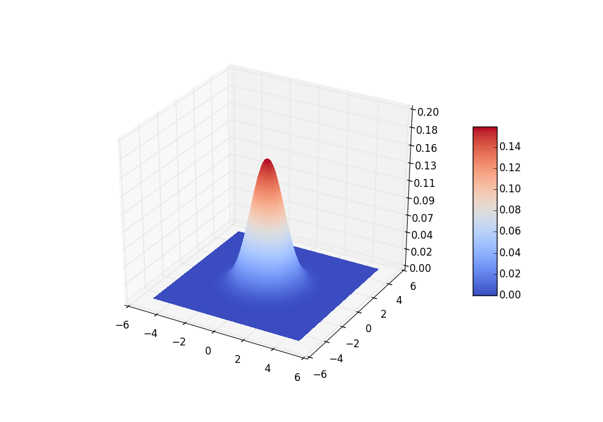

# 3D plots

####Sections
&#8226; [3D Scatterplot](#3d_scatterplot) 
&#8226; [3D Scatterplot with Eigenvectors](#eigenvectors_3d) 
&#8226; [3D Cube](#cube_3d) 
&#8226; [Bivariate Gaussian Distribution](#bivariate_gaussian) 

-------

 

## 3D Scatterplot

Script: [./flower_data/flower_3d_scatter.py](./flower_data/flower_3d_scatter.py)

-------

 

## 3D Scatterplot with Eigenvectors

Script: [./3d_eigenvectors/eigenvectors_3d.py](./3d_eigenvectors/eigenvectors_3d.py)

-------

 

## 3D Cube

Script: [./3d_cube/cube_3d.py](./3d_cube/cube_3d.py)

-------

 

## Bivariate Gaussian Distribution

Script: [./bivariate_gaussian/bivariate_gaussian.py](./bivariate_gaussian/bivariate_gaussian.py)

-------