# matplotlib-gallery

This repository is a collection of different `matplotlib` plots in IPython notebooks that I needed for my data visualizations.

This project is not connected to the gallery on [http://matplotlib.org/gallery.html](http://matplotlib.org/gallery.html), although there might be some overlap and redundancy.

**To view the IPython notebooks, simply click on the header links or images.**

### Sections

- [2D histograms / heat maps / levelplots](#2d-histograms--heat-maps--levelplots)
- [3D Plots](#3d-plots)
- [Bar plots](#bar-plots)
- [Boxplots and Violinplots](#boxplots-and-violinplots)
- [Errorbar plots](#errorbar-plots)
- [Formatting I: subplots, markers, colors, axes](#formatting-i-subplots-markers-colors-axes)
- [Formatting II: gridlines](#formatting-ii-gridlines)
- [Formatting III: legends](#formatting-iii-what-it-takes-to-become-a-legend)
- [Formatting IV: style sheets](#formatting-iv-style-sheets)
- [Histograms](#histograms)
- [Line plots](#line-plots)
- [Preparing Plots for Publication](#preparing-plots-for-publication)
- [Scatter plots](#scatter-plots)
- [Special plots](#special-plots)
- [Clustering - Heatmaps and Dendrograms](#clustering---heatmaps-and-dendrograms)
- [Tips and Tricks](http://nbviewer.ipython.org/github/rasbt/matplotlib-gallery/blob/master/ipynb/tricks.ipynb)

 
 

#### I am looking forward to your contributions, suggestions, and ideas

If you have any suggestions or want to make additions, I would be very happy if you could send me  

- an [email](mailto:se.raschka@gmail.com),  
- leave me a message on [google+](https://plus.google.com/u/0/+SebastianRaschka),
- or even send me a tweet on [twitter](https://twitter.com/rasbt) (given you can fit it within the 140 character limit ;)).  

Or even better: It would be great if you would simply fork this project and send me a pull request.

 
 
 
 

## [2D histograms / heat maps / levelplots](./ipynb/heatmaps.ipynb)

[[back to top](https://github.com/rasbt/matplotlib-gallery#matplotlib-gallery)]

 
 

<a href='./ipynb/heatmaps.ipynb'>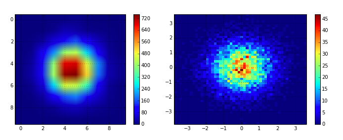</a>

[[NBViewer](http://nbviewer.ipython.org/github/rasbt/matplotlib-gallery/blob/master/ipynb/heatmaps.ipynb)][[GitHub Rendering](./ipynb/heatmaps.ipynb)]

 
 
 
 

## [3D Plots](./ipynb/3dplots.ipynb)

[[back to top](https://github.com/rasbt/matplotlib-gallery#matplotlib-gallery)]

 
 

<a href='./ipynb/3dplots.ipynb'>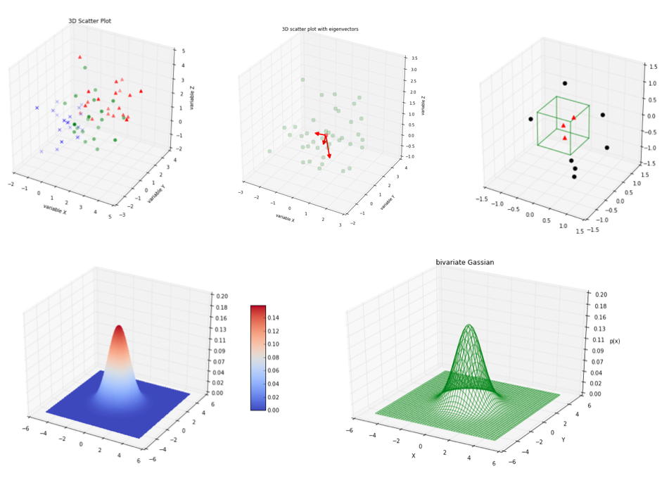</a>

[[NBViewer](http://nbviewer.ipython.org/github/rasbt/matplotlib-gallery/blob/master/ipynb/3dplots.ipynb)][[GitHub Rendering](./ipynb/3dplots.ipynb)]
 
 
 
 

## [Bar plots](./ipynb/barplots.ipynb)

[[back to top](https://github.com/rasbt/matplotlib-gallery#matplotlib-gallery)]

 
 

<a href='./ipynb/barplots.ipynb'>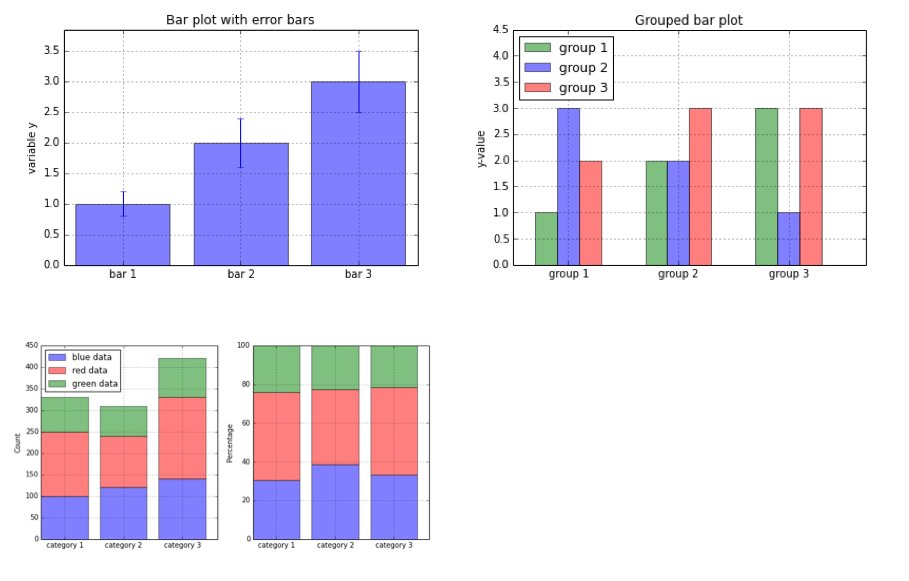</a>

[[NBViewer](http://nbviewer.ipython.org/github/rasbt/matplotlib-gallery/blob/master/ipynb/barplots.ipynb)][[GitHub Rendering](./ipynb/barplots.ipynb)]
 
 
 
 

## [Boxplots and Violinplots](./ipynb/boxplots.ipynb)

[[back to top](https://github.com/rasbt/matplotlib-gallery#matplotlib-gallery)]

 
 

<a href='./ipynb/boxplots.ipynb'>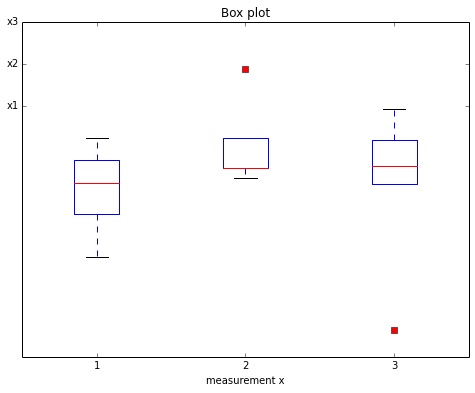</a>

[[NBViewer](http://nbviewer.ipython.org/github/rasbt/matplotlib-gallery/blob/master/ipynb/boxplots.ipynb)][[GitHub Rendering](./ipynb/boxplots.ipynb)]

 
 
 
 

## [Errorbar plots](./ipynb/errorbars.ipynb)

[[back to top](https://github.com/rasbt/matplotlib-gallery#matplotlib-gallery)]

 
 

<a href='./ipynb/errorbars.ipynb'>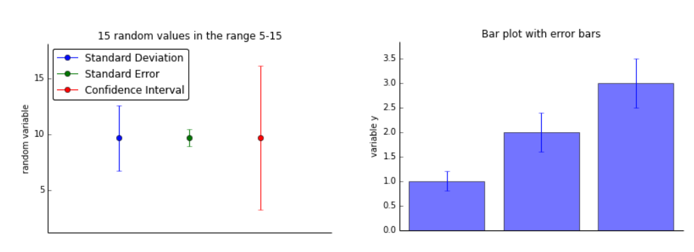</a>

[[NBViewer](http://nbviewer.ipython.org/github/rasbt/matplotlib-gallery/blob/master/ipynb/errorbars.ipynb)][[GitHub Rendering](./ipynb/errorbars.ipynb)]

 
 
 
 

## [Formatting I: subplots, markers, colors, axes](./ipynb/formatting_1.ipynb)

[[back to top](https://github.com/rasbt/matplotlib-gallery#matplotlib-gallery)]

 
 

<a href='./ipynb/formatting_1.ipynb'>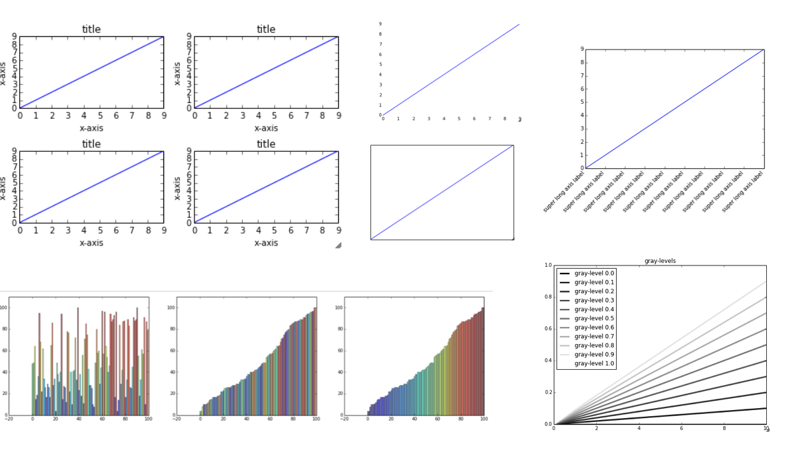</a>

[[NBViewer](http://nbviewer.ipython.org/github/rasbt/matplotlib-gallery/blob/master/ipynb/formatting_1.ipynb)][[GitHub Rendering](./ipynb/formatting_1.ipynb)]

 
 
 
 

## [Formatting II: gridlines](./ipynb/formatting_2.ipynb)

[[back to top](https://github.com/rasbt/matplotlib-gallery#matplotlib-gallery)]

 
 

[[NBViewer](http://nbviewer.ipython.org/github/rasbt/matplotlib-gallery/blob/master/ipynb/formatting_2.ipynb)][[GitHub Rendering](./ipynb/formatting_2.ipynb)]

 
 
 
 

## [Formatting III: What it takes to become a legend](./ipynb/formatting_3.ipynb)

[[back to top](https://github.com/rasbt/matplotlib-gallery#matplotlib-gallery)]

 
 

<a href='./ipynb/formatting_3.ipynb'>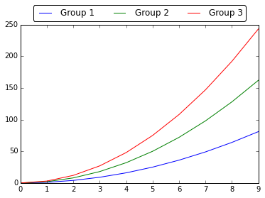</a>

[[NBViewer](http://nbviewer.ipython.org/github/rasbt/matplotlib-gallery/blob/master/ipynb/formatting_3.ipynb)][[GitHub Rendering](./ipynb/formatting_3.ipynb)]

 
 
 
 

## [Formatting IV: Style Sheets](./ipynb/formatting_4.ipynb)

[[back to top](https://github.com/rasbt/matplotlib-gallery#matplotlib-gallery)]

<a href='./ipynb/formatting_4.ipynb'>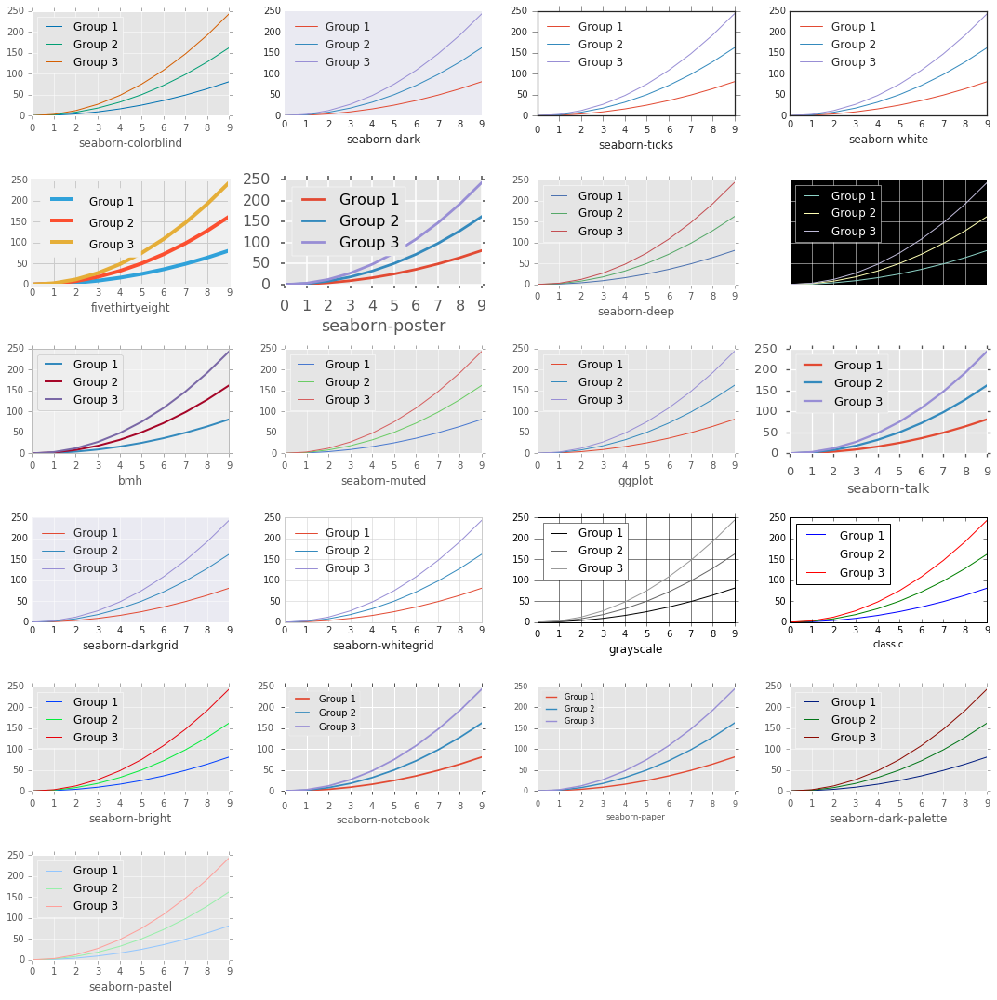</a>

[[NBViewer](http://nbviewer.ipython.org/github/rasbt/matplotlib-gallery/blob/master/ipynb/formatting_4.ipynb)][[GitHub Rendering](./ipynb/formatting_4.ipynb)]

 
 

[[NBViewer](http://nbviewer.ipython.org/github/rasbt/matplotlib-gallery/blob/master/ipynb/formatting_3.ipynb)][[GitHub Rendering](./ipynb/formatting_3.ipynb)]

 
 
 
 

## [Histograms](./ipynb/histograms.ipynb)

[[back to top](https://github.com/rasbt/matplotlib-gallery#matplotlib-gallery)]

 
 

<a href='./ipynb/histograms.ipynb'>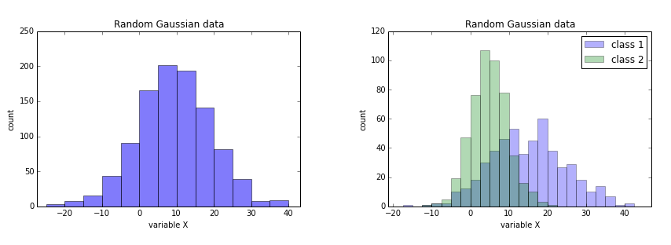</a>

[[NBViewer](http://nbviewer.ipython.org/github/rasbt/matplotlib-gallery/blob/master/ipynb/histograms.ipynb)][[GitHub Rendering](./ipynb/histograms.ipynb)]

 
 
 
 

## [Line plots](./ipynb/lineplots.ipynb)

[[back to top](https://github.com/rasbt/matplotlib-gallery#matplotlib-gallery)]

 
 

<a href='./ipynb/lineplots.ipynb'>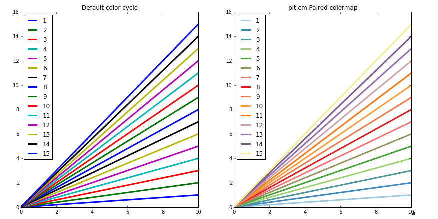</a>

[[NBViewer](http://nbviewer.ipython.org/github/rasbt/matplotlib-gallery/blob/master/ipynb/lineplots.ipynb)][[GitHub Rendering](./ipynb/lineplots.ipynb)]

 
 
 
 

## [Line plots](./ipynb/lineplots.ipynb)

[[back to top](https://github.com/rasbt/matplotlib-gallery#matplotlib-gallery)]

 
 

[[NBViewer](http://nbviewer.ipython.org/github/rasbt/matplotlib-gallery/blob/master/ipynb/lineplots.ipynb)][[GitHub Rendering](./ipynb/lineplots.ipynb)]

 
 
 
 

## [Preparing Plots for Publication](./ipynb/publication.ipynb)

[[back to top](https://github.com/rasbt/matplotlib-gallery#matplotlib-gallery)]

 
 

<a href='./ipynb/publication.ipynb'>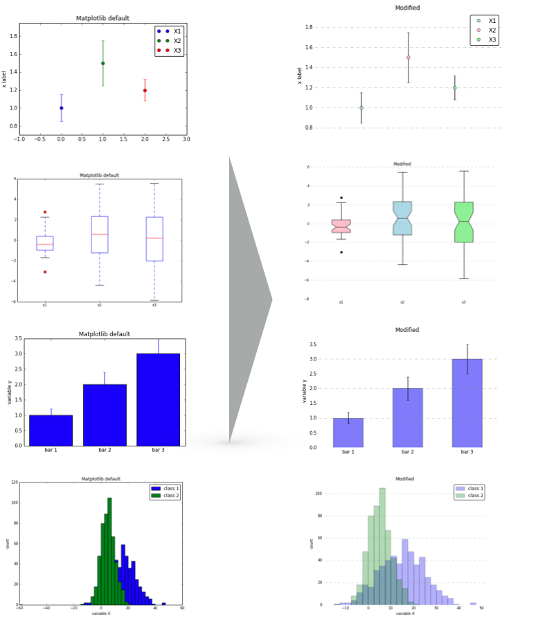</a>

[[NBViewer](http://nbviewer.ipython.org/github/rasbt/matplotlib-gallery/blob/master/ipynb/publication.ipynb)][[GitHub Rendering](./ipynb/publication.ipynb)]

 
 
 
 

## [Scatter plots](./ipynb/scatterplots.ipynb)

[[back to top](https://github.com/rasbt/matplotlib-gallery#matplotlib-gallery)]

 
 

<a href='./ipynb/scatterplots.ipynb'>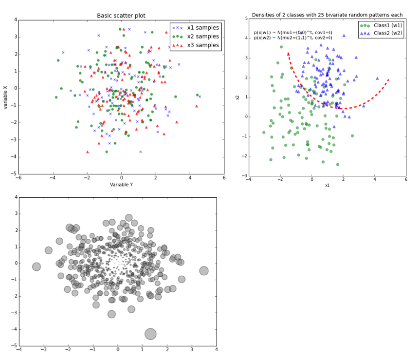</a>

[[NBViewer](http://nbviewer.ipython.org/github/rasbt/matplotlib-gallery/blob/master/ipynb/scatterplots.ipynb)][[GitHub Rendering](./ipynb/scatterplots.ipynb)]

 
 
 
 

## [Special plots](./ipynb/specialplots.ipynb)

[[back to top](https://github.com/rasbt/matplotlib-gallery#matplotlib-gallery)]

 
 

<a href='./ipynb/specialplots.ipynb'>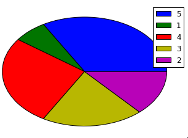</a>

[[NBViewer](http://nbviewer.ipython.org/github/rasbt/matplotlib-gallery/blob/master/ipynb/specialplots.ipynb)][[GitHub Rendering](./ipynb/specialplots.ipynb)]

 
 
 
 

## [Clustering - Heatmaps and Dendrograms](./ipynb/clust_complete_linkage.ipynb)

[[back to top](https://github.com/rasbt/matplotlib-gallery#matplotlib-gallery)]

 
 

<a href='./ipynb/clust_complete_linkage.ipynb'>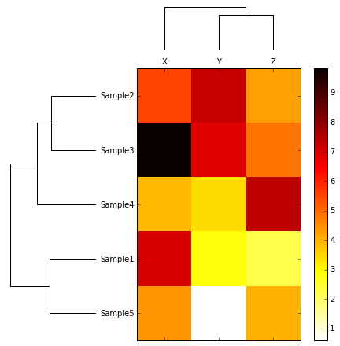</a>

[[NBViewer](http://nbviewer.ipython.org/github/rasbt/matplotlib-gallery/blob/master/ipynb/clust_complete_linkage.ipynb)][[GitHub Rendering](./ipynb/clust_complete_linkage.ipynb)]

 
 
 
 

## [Tips and Tricks](./ipynb/tricks.ipynb)

[[back to top](https://github.com/rasbt/matplotlib-gallery#matplotlib-gallery)]

[[NBViewer](http://nbviewer.ipython.org/github/rasbt/matplotlib-gallery/blob/master/ipynb/tricks.ipynb)][[GitHub Rendering](./ipynb/tricks.ipynb)]

 
 

 
 
 
 
