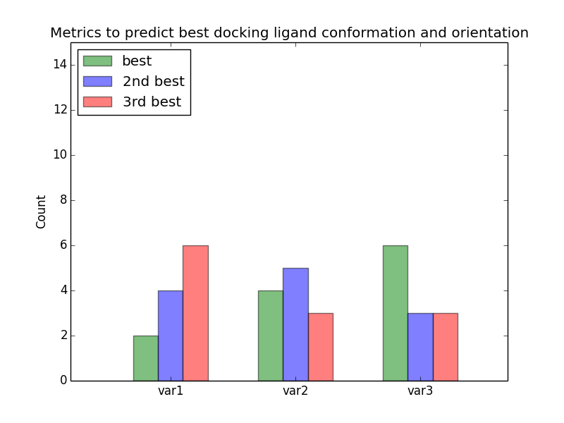
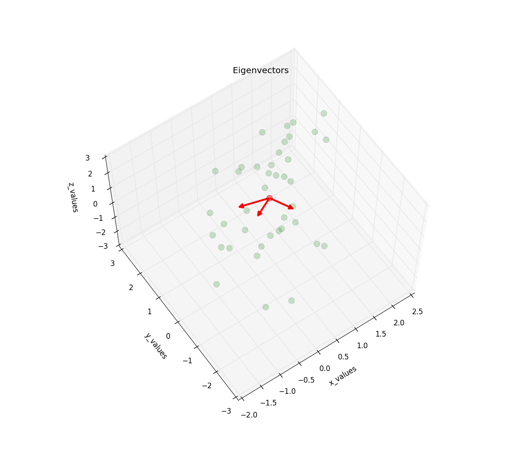
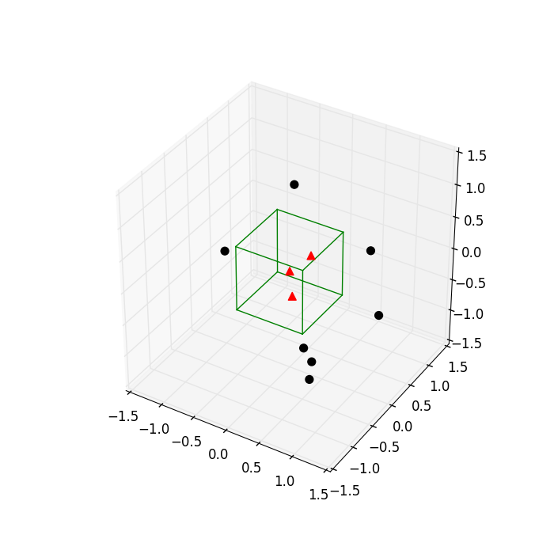
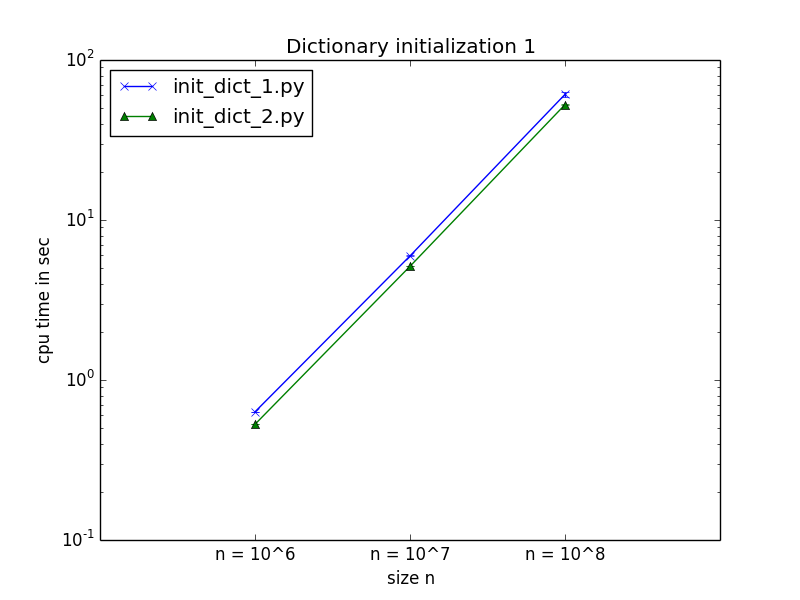
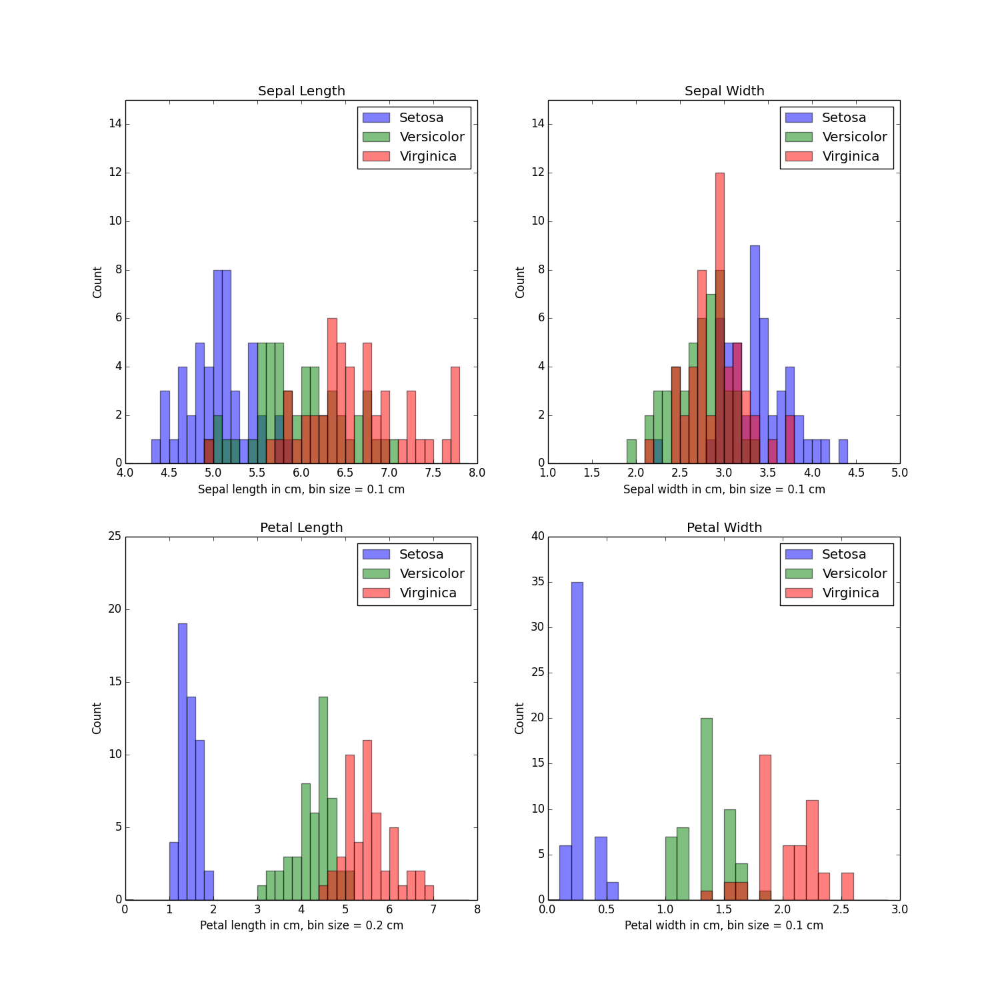
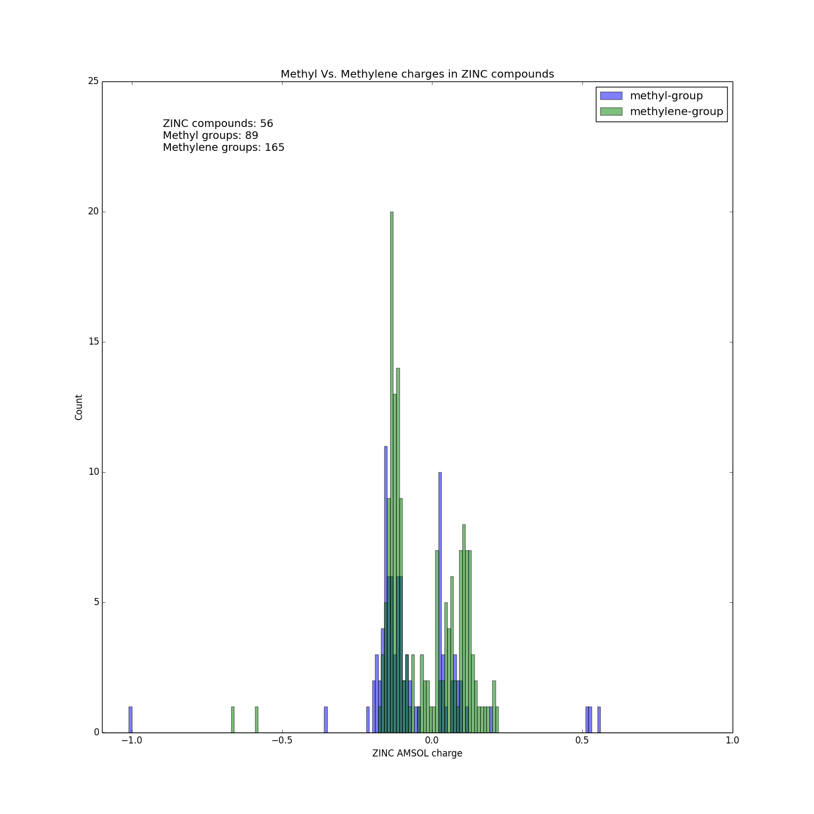
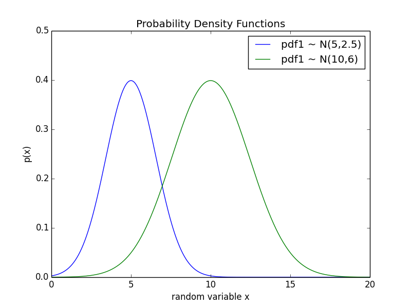
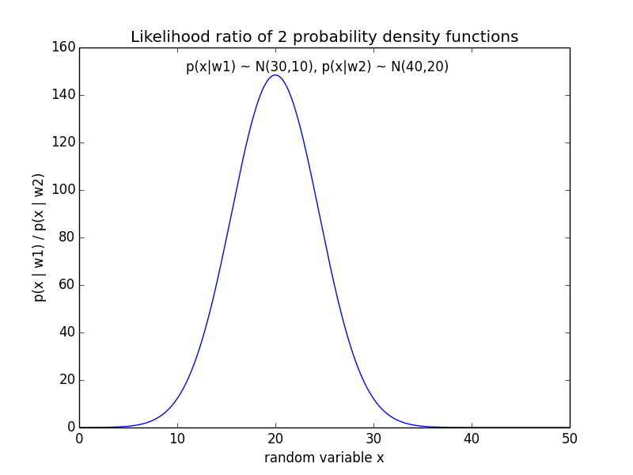

matplotlib_gallery
==================

Examples of matplotlib codes and plots

### [Bar plots](#barplots)
&#8226; [barplot w. error bars](#errorbars1) 
&#8226; [grouped_barplot](#grouped_barplot1) 

### [Scatter plots](#scatterplots)
&#8226; [2D Scatterplot](#2d_scatterplot) 
&#8226; [Categorical Scatterplot](#categoric_scatter) 
&#8226; [Quadratic Decision Boundary](#quadratic_decbound1) 

### [3D Plots](#functionsdistributions)
&#8226; [3D Scatterplot](#3d_scatterplot) 
&#8226; [3D Scatterplot with Eigenvectors](#eigenvectors_3d) 
&#8226; [3D Cube](#cube_3d) 

### [Line plots](#lineplots)
&#8226; [init_dict_1](#init_dict_1) 

### [Histograms](#histograms)
&#8226; [flower_histo](#flower_histo) 
&#8226; [methyl_charges](#methyl_charges) 

### [Functions and distributions](#functionsdistributions)
&#8226; [probability_density_func](#probability_density_func) 
&#8226; [likelihood_ratio](#likelihood_ratio) 

 
 
 
 
 
 

# Bar plots

####Sections
&#8226; [barplot w. error bars](#errorbars1) 
&#8226; [grouped_barplot](#grouped_barplot1) 

-------

 
#### bar plot w. error bars - python_efficiency_tweaks

Script: [barplots/python_efficiency_tweaks/string_subst_bar.py](barplots/python_efficiency_tweaks/string_subst_bar.py)

-------

 
#### grouped bar plot

Script: [barplots/grouped_barplot/grouped_barplot.py](barplots/grouped_barplot/grouped_barplot.py)

-----

 
 
 

# Scatter plots

####Sections
&#8226; [2D Scatterplot](#2d_scatterplot) 
&#8226; [3D Scatterplot](#3d_scatterplot) 
&#8226; [Categoric Scatterplot](#categoric_scatter) 
&#8226; [Quadratic Decision Boundary](#quadratic_decbound1) 

-------

 

#### 2D Scatterplot

Script: [scatterplots/flower_data/flower_2d_scatter.py](scatterplots/flower_data/flower_2d_scatter.py)

-------

 

#### Categoric Scatterplot

Script: [scatterplots/categoric_scatter/categoric_scatter.py](scatterplots/categoric_scatter/categoric_scatter.py)

-------

 

#### Quadratic Decision Boundary

Script: [scatterplots/quadratic_decision_boundary/quadratic_decision_boundary](scatterplots/quadratic_decision_boundary/quadratic_decision_boundary.py)

-------
# 3D plots

####Sections
&#8226; [3D Scatterplot](#3d_scatterplot) 
&#8226; [3D Scatterplot with Eigenvectors](#eigenvectors_3d) 

-------

 

#### 3D Scatterplot

Script: [./3d_plots/flower_data/flower_3d_scatter.py](./3d_plots/flower_data/flower_3d_scatter.py)

-------

 

#### 3D Scatterplot with Eigenvectors

Script: [./3d_plots/3d_eigenvectors/eigenvectors_3d.py](./3d_plots/3d_eigenvectors/eigenvectors_3d.py)

-------

 

## 3D Cube

Script: [./3d_plots/3d_cube/cube_3d.py](./3d_plots/3d_cube/cube_3d.py)

-------

 
 
 

# Line plots

####Sections
&#8226; [init_dict_1](#init_dict_1) 

-------

 

#### python_efficiency_tweaks - init_dict.py

Script: [line_plots/python_efficiency_tweaks/init_dict_1.py](line_plots/python_efficiency_tweaks/init_dict_1.py)

-----

 
 
 

# Histograms

####Sections
&#8226; [flower_histo](#flower_histo) 
&#8226; [methyl_charges](#methyl_charges) 

-------

 

####flower_histo

Script: [histograms/flower_data/flower_histo.py](histograms/flower_data/flower_histo.py)

-------

 

####methyl_charges

Script: [histograms/methyl_charges/plot_methyl_charges.py](histograms/methyl_charges/plot_methyl_charges.py)

-------

 
 
 

# Functions and distributions

####Sections
&#8226; [probability_density_func](#probability_density_func) 
&#8226; [likelihood_ratio](#likelihood_ratio) 

 
 

-----

 

#### Normal Probability Density Functions

Script: [functions_and_distributions/probability_density_func/probability_density_func.py](functions_and_distributions/probability_density_func/probability_density_func.py)

-----

 	
#### Likelihood Ratio

Script: [functions_and_distributions/probability_density_func/likelihood_ratio.py](functions_and_distributions/probability_density_func/likelihood_ratio.py)

-----
