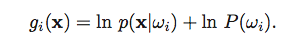
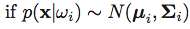
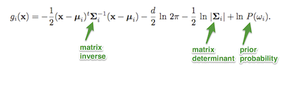

# Functions and distributions

####Sections
&#8226; [probability_density_func](#probability_density_func) 
&#8226; [likelihood_ratio](#likelihood_ratio) 

 
 

-----

 

## Normal Probability Density Functions

Script: [./probability_density_func/probability_density_func.py](./probability_density_func/probability_density_func.py)

-----

 	
## Likelihood Ratio

Script: [./probability_density_func/likelihood_ratio.py](./probability_density_func/likelihood_ratio.py)

-----

## Discriminant Function for Normal Densities

