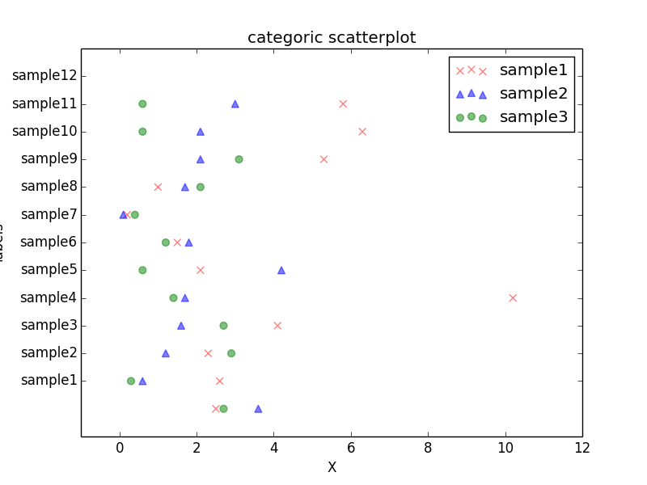
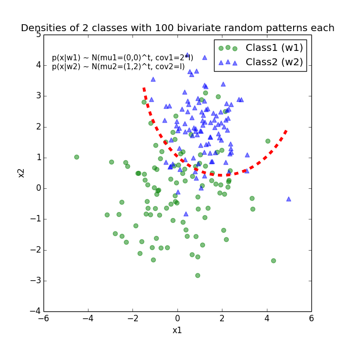

# Scatter plots

####Sections
&#8226; [2D Scatterplot](#2d_scatterplot) 
&#8226; [Categoric Scatterplot](#categoric_scatter) 
&#8226; [Quadratic Decision Boundary](#quadratic_decbound1) 

-------

 

## 2D Scatterplot

Script: [./flower_data/flower_2d_scatter.py](./flower_data/flower_2d_scatter.py)

 

## Categoric Scatterplot

Script: [./categoric_scatter/categoric_scatter.py](./categoric_scatter/categoric_scatter.py)

-------

 

## Quadratic Decision Boundary

Script: [./quadratic_decision_boundary/quadratic_decision_boundary](./quadratic_decision_boundary/quadratic_decision_boundary.py)